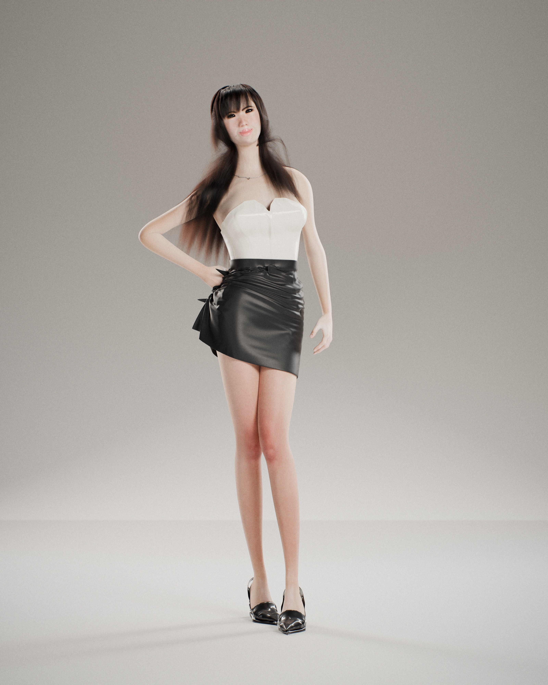

# chaewon-model

A photorealistic full-body Blender character: **Mira**, an original fictional
Korean idol (early twenties) styled for a K-pop concept / fashion-editorial
shoot. The photos in `ref-images/` were used only as a mood reference for
styling (hair, makeup, silhouette, wardrobe). The face is an original design,
not a likeness of any real person.



Renders (`renders/`):

- `mira_fullbody_final.jpg` / `.png`: hero full-body frame, 3200×4000 (4:5), photographic finish
- `mira_fullbody_3200x4000_raw.png`: untouched 16-bit Cycles output (320 spp, OIDN)
- `mira_beauty_final.jpg`: bonus beauty close-up from `CAM_Beauty_CloseUp` (2400×3000)
- `wip/`: progress shots from each milestone

## Look

| | |
|---|---|
| Character | Petite and slim (1.62 m, 1.70 m in heels), narrow waist, long legs, full but natural bust |
| Hair | Long, layered dark brown, see-through bangs, face-framing layers, C-curled ends, ~95k strands |
| Makeup | Luminous even base, peach-pink blush, soft brown lid with a short lifted liner wing, aegyo-sal highlight, gradient MLBB lips |
| Wardrobe | Ivory satin strapless corset bustier (sweetheart neckline, boning seams, piping) tucked into a black satin A-line mini skirt |
| Shoes / jewelry | Black patent pointed-toe stiletto pumps, fine silver curb chain with a crystal drop |
| Pose | Contrapposto: weight on the right leg, left knee crossing forward, hip shift and S-curve, hand on hip, head tilt, soft smile, eyes to camera |
| Camera | 85 mm full-frame equivalent, f/4 focused on the eyes, vertical 4:5 |
| Lighting | Short-lit 1.6 m octabox key, large soft fill, twin rim strips, hair light, gradient seamless cyclorama, floor bounce |
| Render | Cycles (Metal GPU), adaptive sampling, OpenImageDenoise, AgX colour management, 3200×4000 |

## Files

```
mira_idol.blend          main scene (open in Blender 5.2+ with the MPFB extension)
textures/                generated 4K skin maps (albedo/makeup, roughness, height, masks)
renders/                 final renders (raw + photographic finish), wip/ progress shots
scripts/                 everything used to build the scene (see below)
ref-images/              styling references
```

### Scene organisation

- `CHAR_Mira` holds the MPFB body + 163-bone rig, eyes, brows, lashes, teeth and tongue, plus
  `Mira_Hair` (curves), `Mira_Top_Bustier`, `Mira_Skirt`, `Mira_Shoe_*` and `Mira_Necklace_*`.
  Every part is parented to the rig (or to a rig bone).
- `STUDIO` holds `Studio_Cyclorama`, with all lights in `STUDIO/LIGHTS`.
- `CAMERAS` holds `CAM_Main_85mm` (hero full body), `CAM_Beauty_CloseUp`, and `FOCUS_Eyes`
  (the DOF target on the head bone).

Materials: `MAT_Mira_Skin` (random-walk skin SSS, 4K maps, pore and micro bump, lip gloss coat,
peach-fuzz sheen), `MAT_Mira_Hair` (Principled Hair, melanin, darker roots),
`MAT_Bustier_IvorySatin` / `MAT_Skirt_BlackSatin` (anisotropic satin with weave bump),
`MAT_Shoe_BlackPatent`, `MAT_Metal_Silver`, `MAT_Crystal`.

## Pipeline (scripts/)

| Script | Purpose |
|---|---|
| `gen_skin_textures.py` | Runs outside Blender (numpy + OpenCV). Rasterizes the body UVs at 4K, finds eyelids, lips, nose and brows on the mesh, and paints tone, makeup, roughness and pore height in UV space. |
| `pose_mira.py` | Contrapposto pose: analytic two-bone IK with pole vectors for legs and arms, distributed spine/neck rotation, plantarflexed feet for heels. |
| `gen_hair.py` | Strand hair. Guides are grown with gravity, scalp hugging, body collision and a face keep-out; children get clumping, waves, flyaways and C-curl tips. |
| `gen_clothes.py` | Bustier from convexified torso sections, plus a skirt tube for cloth simulation. Both get body weights. |
| `gen_shoes.py` | Pumps lofted from convex foot sections, with a pointed toe, vamp/topline cut, outsole and stiletto. |
| `gen_jewelry.py` | Chain of real alternating links draped on the posed body, crystal drop. |
| `build_stage3.py` | Reproducible pipeline steps: proportions, pose, expression, hair, garments, cloth sim, freeze, shoes, jewelry, texture regeneration. |
| `postprocess_photo.py` | Photographic finish on the raw render: grade, highlight roll-off, faint lateral CA, vignette, fine grain. |

Third-party assets: base human, rig, eyes, brows, lashes and the base skin texture come from
[MPFB2](https://static.makehumancommunity.org/mpfb.html) (GPL) and the MakeHuman CC0 system asset pack.

### Rendering

```bash
/Applications/Blender.app/Contents/MacOS/Blender -b mira_idol.blend -o //renders/mira_fullbody_#### -f 1
python3 scripts/postprocess_photo.py renders/mira_fullbody_0001.png renders/mira_fullbody_final
```
